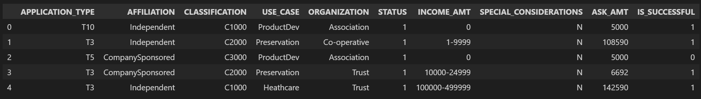

# Neural_Network_Charity_Analysis
 
## Overview

This analysis looked at data on charity contributions from a company called AlphabetSoup. The dataset described each contribution using attributes such as amount requested, use case, and various other classification schemes, as well as whether or not the charity succeeded in its objective. The goal of this analysis was to attempt to predict the viability of a potential donation using a neural network trained on previous recipient data.

The data columns can be seen below:

## Results

### Preprocessing

### Modeling

## Summary